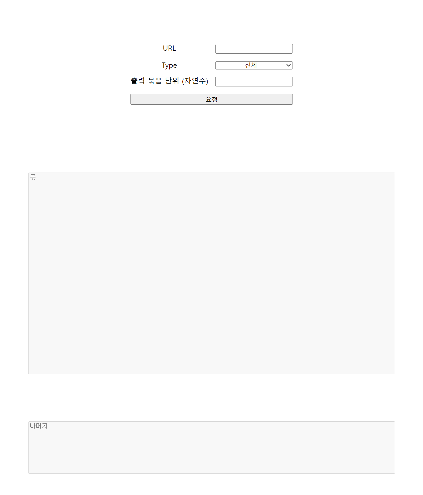
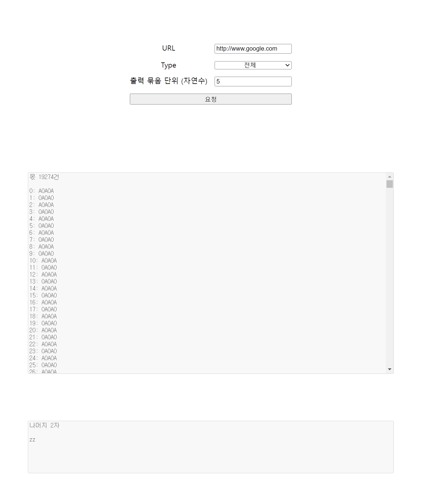
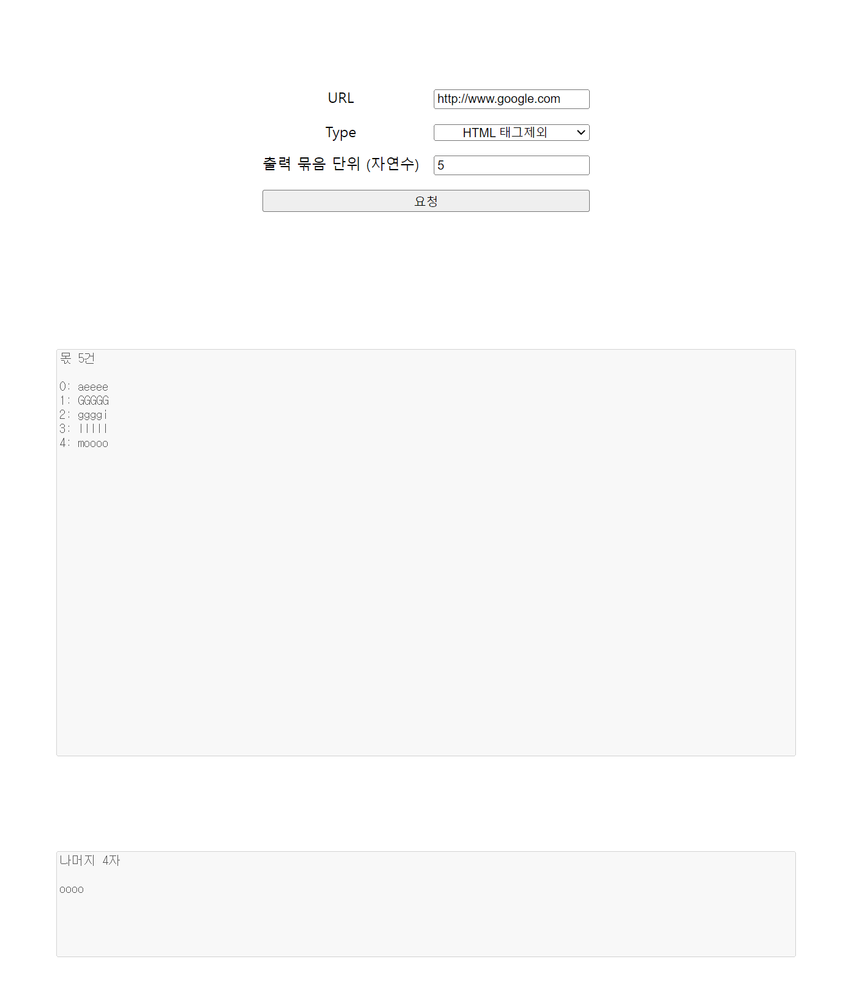

# HTML Parser

## 목차
### 1. [개요](#1-개요-1)
### 2. [조건](#2-조건-1)
### 3. [화면 설계](#3-화면-설계-미리보기-1)
### 4. [가공 절차](#4-가공-절차-1)
### 5. [기능 설계](#5-기능-설계-1)
### 6. [테스트 코드](#6-테스트-코드-1)
### 7. [빌드 및 구동](#7-빌드-및-구동-1)
### 8. [시연 화면](#8-시연-화면-1)

---
### 1. 개요
특정 URL로부터 받아온 HTML 구조를  
어떠한 조건에 맞게 가공하여 문자열로 제공하는 기능
---
### 2. 조건
1. HTML에서 Docktype은 제외한다.
2. 영어와 숫자를 제외한 모든 문자는 버린다.
3. 오름차순으로 정리한다.
    * 영어의 경우 AaBbCc...
    * 숫자의 경우 0123... (단, 모든 숫자는 1자리 숫자로 소분된다 가정)
4. 영어와 숫자를 교차로 배치하여 정리한다.
    * a2B4b5d9...
---
### 3. 화면 설계 미리보기
* 사용자가 URL과 Type 옵션, 묶음 단위를 선택할 수 있도록 입력창을 구성한다.
* 입력한 옵션의 결과를 요청하는 버튼을 배치한다.
* 결과를 반환받을 때 까지 Loading 이미지를 보여준다.
* 반환받은 결과는 몫과 나머지 영역에 출력한다.
    



---
### 4. 가공 절차
1. 입력한 URL의 HTML 구조를 가져온다.
2. 선택한 Type 옵션에 따라 구조를 정리한다.
    * '전체' 타입은 태그의 꺽쇠를 제외한 모든 문자열이 가공 대상
    * 'HTML 태그 제괴' 타입은 태그를 제외한 모든 문자열이 가공 대상
3. 입력한 묶음 단위로 정리된 문자열을 자른다.
    * 5를 묶음단위로 입력하면, 정리된 문자열이 5자 단위로 잘린다.
4. 잘린 묶음들과 남은 문자열을 반환한다.
---
### 5. 기능 설계
#### HTML 구조 정리
[JsoupRepository](https://github.com/kimheonseung/html-parser/blob/master/src/main/java/com/devh/project/htmlparser/repository/JsoupRepository.java)
* HTML 구조를 다루는 Jsoup 라이브러리 이용하여 다음 처리를 수행한다.
    * URL을 통해 HTML 구조를 반환받아 Docktype을 제거
    * 대소문자를 구분하는 Parser 이용
* 문자열화 된 HTML 구조에서 '<'와 '>'를 제거한다.
* 정규식을 통해 영어와 숫자만 남긴다.

#### 정렬
[ParserService.sort()](https://github.com/kimheonseung/html-parser/blob/master/src/main/java/com/devh/project/htmlparser/service/ParserService.java)
* 정리된 문자열을 1번의 반복으로 문자열 리스트와 숫자 리스트로 나눈다.
* Comparator를 통해 조건에 맞게 각 리스트를 정렬한다.
* 두 리스트의 길이를 참고하여 각 리스트에서 하나씩 선택해 영어와 숫자의 교차 문자열을 생성한다.

#### 연산
[ParserService.calculateBunchesAndRemainder()](https://github.com/kimheonseung/html-parser/blob/master/src/main/java/com/devh/project/htmlparser/service/ParserService.java)
* 사용자가 입력한 묶음 단위로 몫에 해당하는 문자열 리스트를 생성한다.
* 남는 문자열은 나머지 문자열로 취급한다.
---
### 6. 테스트 코드  
> 테스트 수행을 위해 test.html을 별도로 생성함
> 
> 해당 HTML을 기준으로 각 기능을 확인하는 테스트 코드를 작성함

[JsoupRepositoryTests](https://github.com/kimheonseung/html-parser/blob/master/src/test/java/com/devh/project/htmlparser/repository/JsoupRepositoryTests.java)
* Jsoup 기능 단위 테스트와 HTML 구조를 정리하여 반환하는 기능 테스트  

[ParserServiceTests](https://github.com/kimheonseung/html-parser/blob/master/src/test/java/com/devh/project/htmlparser/service/ParserServiceTests.java)
* 정리된 HTML 구조를 정렬하고 묶음과 나머지를 연산하는 기능 테스트

[ParserControllerTests](https://github.com/kimheonseung/html-parser/blob/master/src/test/java/com/devh/project/htmlparser/controller/ParserControllerTests.java)
* UI에서 요청한 값에 대한 최종 반환 결과를 확인하는 테스트
---
### 7. 빌드 및 구동
```shell
# 1. git clone
$ git clone https://kimheonseung@github.com/kimheonseung/html-parser.git ./html-parser
$ ls -al

total 12
drwxrwxr-x  3 hskim hskim 4096  7월 15 22:38 .
drwxr-xr-x 32 hskim hskim 4096  7월 15 22:38 ..
drwxrwxr-x  8 hskim hskim 4096  7월 15 22:38 html-parser

# 2. gradle change mod
$ cd html-parser
$ chmod +x gradlew

# !! application.yml 포트가 기본 8080으로 설정되어있음. 
# !! 테스트 및 빌드시 수정이 필요할 수 있음

# 3. gradle test (skip if you want)
$ ./gradlew clean test -i

# 4. gradle build (contains test)
$ ./gradlew clean build -i

# 5. check JAR
$ cd build/libs/
$ ls -al

total 17736
drwxrwxr-x 2 hskim hskim     4096  7월 15 22:44 .
drwxrwxr-x 9 hskim hskim     4096  7월 15 22:44 ..
-rw-rw-r-- 1 hskim hskim 18101870  7월 15 22:44 html-parser-v1.jar
-rw-rw-r-- 1 hskim hskim    47115  7월 15 22:44 html-parser-v1-plain.jar

# 6. start server (foreground)
$ java -jar html-parser-v1.jar

# 7. UI
http://localhost:port
```
---
### 8. 시연 화면

#### '전체' 옵션 요청


#### 'HTML 태그 제외' 옵션 요청
